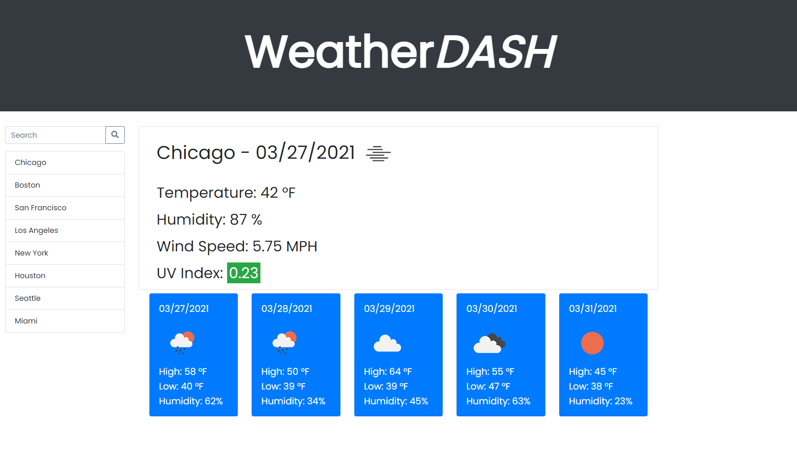

# WeatherDash

## Description
WeatherDash is a web application that displays the weather for a given city. Cities can be searched for as well as a selection of popular cities are available as buttons to avoid having to type. The app displays current weather conditions as well as the forecast for the upcoming 5 days.

## Current Weather Data provided
- Temperature
- Humidity
- Wind Speed
- UV Index
    - the UV Index will be displayed in a colored box that is color coded to the severity of that index

## Screenshot

## Deployment
You can view the deployed application [here](https://koxuvar.github.io/JS-WeatherDash/)